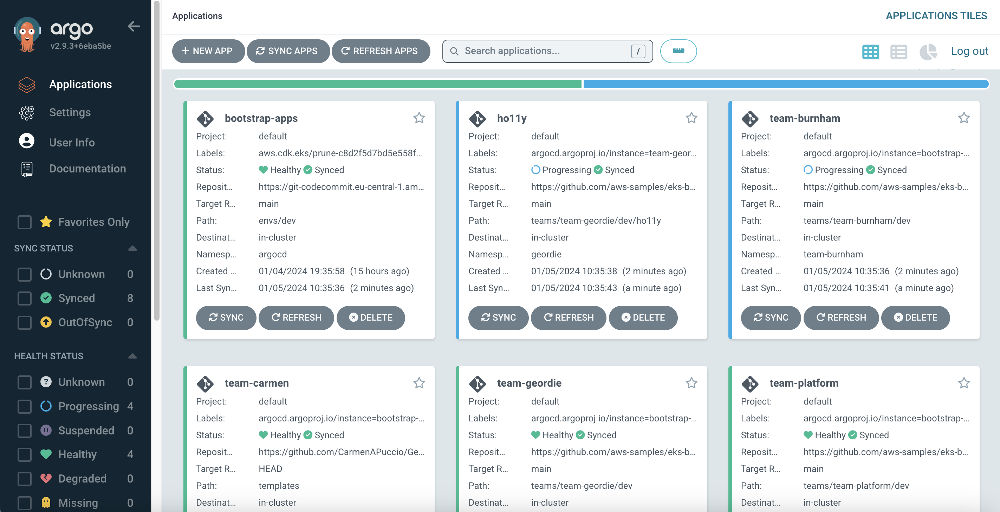

# EKS Cluster with ArgoCD and Workloads in private AWS CodeCommit repository

## Objective

This example shows how to provision an EKS cluster with:

- ArgoCD
- Workloads deployed by ArgoCD
- Private AWS CodeCommit repository to store the configurations of workloads
- Setup to trigger ArgoCD projects sync on git push to AWS CodeCommit repository

Pattern source: /lib/workloads-codecommit-construct/index.ts

## Architecture


To better understand how ArgoCD works with EKS Blueprints, read the EKS Blueprints ArgoCD [Documentation](https://aws-quickstart.github.io/cdk-eks-blueprints/addons/argo-cd/)

- After a push to AWS CodeCommit repository notification trigger calls AWS Lambda
- AWS Lambda calls ArgoCD webhook URL to trigger ArgoCD projects sync

## Prerequisites

Ensure that you have installed the following tools on your machine.

1. [aws cli](https://docs.aws.amazon.com/cli/latest/userguide/install-cliv2.html)
2. [kubectl](https://Kubernetes.io/docs/tasks/tools/)
3. [cdk](https://docs.aws.amazon.com/cdk/v2/guide/getting_started.html#getting_started_install)
4. [npm](https://docs.npmjs.com/cli/v8/commands/npm-install)
5. [jq](https://jqlang.github.io/jq/)
6. `make`

## Deploy EKS Cluster with Amazon EKS Blueprints for CDK

1. Clone the repository

```sh
git clone https://github.com/aws-samples/cdk-eks-blueprints-patterns.git
cd cdk-eks-blueprints-patterns
```

2. Update npm

```sh
npm install -g npm@latest
```

3. View patterns and deploy workloads-codecommit pattern

```sh
make list
npx cdk bootstrap
make pattern workloads-codecommit deploy
```

## Verify the resources

1. Run the update-kubeconfig command. You should be able to get the command from the CDK output message. More information can be found at https://aws-quickstart.github.io/cdk-eks-blueprints/getting-started/#cluster-access

```sh
aws eks update-kubeconfig --name workloads-codecommit-blueprint --region <your region> --role-arn arn:aws:iam::xxxxxxxxx:role/workloads-codecommit-blue-workloadscodecommitbluepr-VH6YOKWPAt5H
```

2. Verify the resources created from the steps above.

```bash
$ kubectl get po -n argocd
NAME                                          READY   STATUS    RESTARTS   AGE
blueprints-addon-argocd-application-controller-0                  1/1     Running   0          1h
blueprints-addon-argocd-applicationset-controller-7b78c7fc5dmkx   1/1     Running   0          1h
blueprints-addon-argocd-dex-server-6cf94ddc54-p68pl               1/1     Running   0          1h
blueprints-addon-argocd-notifications-controller-6f6b7d95ckhf6p   1/1     Running   0          1h
blueprints-addon-argocd-redis-b8dbc7dc6-dvbkr                     1/1     Running   0          1h
blueprints-addon-argocd-repo-server-66df7f448f-kvwmw              1/1     Running   0          1h
blueprints-addon-argocd-server-584db5f545-8xp48                   1/1     Running   0          1h
```

## Give ArgoCD access to AWS CodeCommit

```bash
until kubectl get svc blueprints-addon-argocd-server -n argocd -o json | jq --raw-output '.status.loadBalancer.ingress[0].hostname' | grep -m 1 "elb.amazonaws.com"; do sleep 5 ; done;
export ARGOCD_SERVER=`kubectl get svc blueprints-addon-argocd-server -n argocd -o json | jq --raw-output '.status.loadBalancer.ingress[0].hostname'`

export ARGOCD_USER=argocd-cc
export CC_REPO_NAME=eks-blueprints-workloads-cc

aws iam create-service-specific-credential --user-name $ARGOCD_USER --service-name codecommit.amazonaws.com --no-cli-pager
export CC_REPO_URL=$(aws codecommit get-repository --repository-name $CC_REPO_NAME --query 'repositoryMetadata.cloneUrlHttp' --output text)
export SSC_ID=$(aws iam list-service-specific-credentials --user-name $ARGOCD_USER --query 'ServiceSpecificCredentials[0].ServiceSpecificCredentialId' --output text)
export SSC_USER=$(aws iam list-service-specific-credentials --user-name $ARGOCD_USER --query 'ServiceSpecificCredentials[0].ServiceUserName' --output text)
export SSC_PWD=$(aws iam reset-service-specific-credential --user-name $ARGOCD_USER --service-specific-credential-id $SSC_ID --query 'ServiceSpecificCredential.ServicePassword' --output text)

cat > argocd-workloads-repos-creds.yaml <<EOF
apiVersion: v1
kind: Secret
metadata:
  name: repo-creds-platform-https
  namespace: argocd
  labels:
    argocd.argoproj.io/secret-type: repo-creds
stringData:
  url: ${CC_REPO_URL}
  password: ${SSC_PWD}
  username: ${SSC_USER}
EOF

kubectl apply -f argocd-workloads-repos-creds.yaml
rm argocd-workloads-repos-creds.yaml

echo Deployment finished.
echo "AWS CodeCommit Blueprint workloads repository URL: $CC_REPO_URL"
echo "ArgoCD URL: https://$ARGOCD_SERVER"
echo "ArgoCD server user: admin"
echo "ArgoCD admin password: $(kubectl -n argocd get secret argocd-initial-admin-secret -o jsonpath="{.data.password}" | base64 -d)"
```

## Create notification trigger

```bash
export LAMBDA_ARN=$(aws lambda get-function --function-name eks-blueprints-workloads-cc-webhook | jq -r .Configuration.FunctionArn)

cat > trigger.json <<EOF
[
  {
      "destinationArn": "${LAMBDA_ARN}",
      "branches": [],
      "name": "${CC_REPO_NAME}-trigger",
      "customData": "${ARGOCD_SERVER}",
      "events": [
          "all"
      ]
  }
]
EOF

aws codecommit put-repository-triggers --repository-name $CC_REPO_NAME --triggers file://trigger.json --no-cli-pager
rm trigger.json
```

## Populate AWS CodeCommit with Blueprint workloads Sample repository

```bash
pushd ..
git clone https://github.com/aws-samples/eks-blueprints-workloads.git
git clone codecommit::$AWS_REGION://$CC_REPO_NAME
cd $CC_REPO_NAME
git checkout -b main
cd ..
rsync -av eks-blueprints-workloads/ $CC_REPO_NAME --exclude .git
cd $CC_REPO_NAME
git add . && git commit -m "initial commit" && git push --set-upstream origin main
popd
```

ArgoCD will receive notification and will start sync.



## Destroy

To teardown and remove the resources created in this example:

1. Delete "bootstrap-apps" project in ArgoCD UI and wait until ArgoCD delete workloads

2. Delete AWS CodeCommit credentials

```sh
export SSC_ID=$(aws iam list-service-specific-credentials --user-name $ARGOCD_USER --query 'ServiceSpecificCredentials[1].ServiceSpecificCredentialId' --output text)
aws iam delete-service-specific-credential --user-name $ARGOCD_USER --service-specific-credential-id $SSC_ID
export SSC_ID=$(aws iam list-service-specific-credentials --user-name $ARGOCD_USER --query 'ServiceSpecificCredentials[0].ServiceSpecificCredentialId' --output text)
aws iam delete-service-specific-credential --user-name $ARGOCD_USER --service-specific-credential-id $SSC_ID
```

3. Delete deployed resources

```sh
cd cdk-eks-blueprints-patterns
make pattern workloads-codecommit destroy
```

4. Delete cloned repositories (`if necessary`)

```sh
pushd ..
rm -rf eks-blueprints-workloads-cc
rm -rf eks-blueprints-workloads
popd
```
